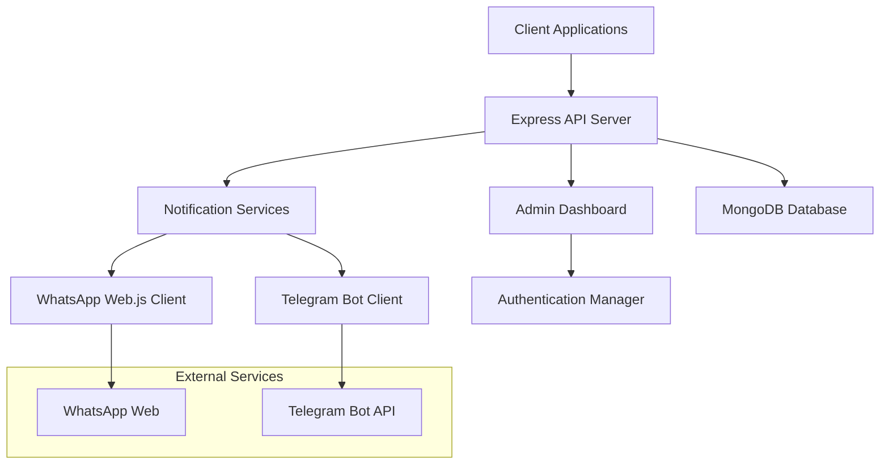
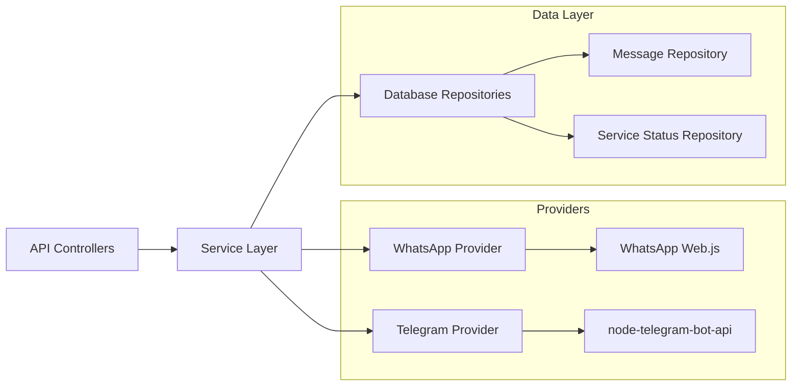

# Design Document

## Overview

The notification service is a Node.js Express application built with TypeScript that provides API endpoints for sending WhatsApp and Telegram notifications. The system features an admin panel for authentication management, MongoDB for data persistence, and supports both WhatsApp Web.js and Telegram Bot API integrations.

## Architecture

### High-Level Architecture



### Service Layer Architecture



## Components and Interfaces

### Core Components

#### 1. API Layer
- **Controllers**: Handle HTTP requests and responses
- **Middleware**: Authentication, validation, error handling
- **Routes**: Define API endpoints

#### 2. Service Layer
- **NotificationService**: Orchestrates message sending
- **WhatsAppProvider**: Manages WhatsApp Web.js client
- **TelegramProvider**: Manages Telegram bot client
- **AuthenticationManager**: Handles service authentication states

#### 3. Data Layer
- **Models**: Mongoose schemas for MongoDB
- **Repositories**: Data access layer abstraction

#### 4. Admin Dashboard
- **React Frontend**: Admin panel for service management
- **WebSocket Connection**: Real-time status updates
- **QR Code Display**: WhatsApp authentication interface

### Key Interfaces

#### NotificationRequest Interface
```typescript
interface NotificationRequest {
  recipient: string;
  message: string;
  type?: 'text' | 'media';
  metadata?: Record<string, any>;
}
```

#### ServiceStatus Interface
```typescript
interface ServiceStatus {
  service: 'whatsapp' | 'telegram';
  status: 'connected' | 'disconnected' | 'authenticating';
  lastUpdated: Date;
  metadata?: {
    qrCode?: string;
    botToken?: string;
    connectionInfo?: any;
  };
}
```

#### MessageRecord Interface
```typescript
interface MessageRecord {
  id: string;
  service: 'whatsapp' | 'telegram';
  recipient: string;
  message: string;
  status: 'pending' | 'sent' | 'failed';
  timestamp: Date;
  errorMessage?: string;
  messageId?: string;
}
```

## Data Models

### MongoDB Schemas

#### Message Schema
```typescript
const MessageSchema = new Schema({
  service: { type: String, enum: ['whatsapp', 'telegram'], required: true },
  recipient: { type: String, required: true },
  message: { type: String, required: true },
  status: { type: String, enum: ['pending', 'sent', 'failed'], default: 'pending' },
  timestamp: { type: Date, default: Date.now },
  errorMessage: { type: String },
  messageId: { type: String },
  metadata: { type: Schema.Types.Mixed }
});
```

#### ServiceStatus Schema
```typescript
const ServiceStatusSchema = new Schema({
  service: { type: String, enum: ['whatsapp', 'telegram'], required: true, unique: true },
  status: { type: String, enum: ['connected', 'disconnected', 'authenticating'], required: true },
  lastUpdated: { type: Date, default: Date.now },
  metadata: {
    qrCode: { type: String },
    botToken: { type: String },
    connectionInfo: { type: Schema.Types.Mixed }
  }
});
```

#### AdminUser Schema
```typescript
const AdminUserSchema = new Schema({
  username: { type: String, required: true, unique: true },
  passwordHash: { type: String, required: true },
  role: { type: String, enum: ['admin'], default: 'admin' },
  lastLogin: { type: Date },
  createdAt: { type: Date, default: Date.now }
});
```

## Error Handling

### Error Types
1. **Authentication Errors**: WhatsApp/Telegram authentication failures
2. **Validation Errors**: Invalid request parameters
3. **Service Errors**: External service unavailability
4. **Database Errors**: MongoDB connection/query failures

### Error Response Format
```typescript
interface ErrorResponse {
  error: {
    code: string;
    message: string;
    details?: any;
  };
  timestamp: string;
  path: string;
}
```

### Error Handling Strategy
- Global error middleware for consistent error responses
- Service-specific error handling with retry mechanisms
- Graceful degradation when services are unavailable
- Comprehensive logging for debugging

## Testing Strategy

### Unit Testing
- **Controllers**: Mock service dependencies, test request/response handling
- **Services**: Mock external APIs, test business logic
- **Repositories**: Mock MongoDB, test data operations
- **Utilities**: Test helper functions and validators

### Integration Testing
- **API Endpoints**: Test complete request/response cycles
- **Database Operations**: Test with test MongoDB instance
- **Service Integration**: Test with mock WhatsApp/Telegram services

### End-to-End Testing
- **Admin Panel**: Test authentication and service management flows
- **Message Sending**: Test complete notification workflows
- **Error Scenarios**: Test error handling and recovery

### Testing Tools
- **Jest**: Unit and integration testing framework
- **Supertest**: HTTP assertion library for API testing
- **MongoDB Memory Server**: In-memory MongoDB for testing
- **Puppeteer**: Admin panel UI testing

## Security Considerations

### Authentication & Authorization
- JWT-based admin authentication
- Rate limiting on API endpoints
- Input validation and sanitization
- CORS configuration for admin panel

### Data Protection
- Environment variables for sensitive configuration
- Encrypted storage of bot tokens
- Secure session management
- HTTPS enforcement in production

### Service Security
- WhatsApp session data encryption
- Telegram bot token validation
- Message content sanitization
- Audit logging for admin actions

## Deployment Architecture

### Docker Configuration
- Multi-stage Docker build for optimization
- Separate containers for API and admin panel
- MongoDB container with persistent volumes
- Docker Compose for local development

### Environment Configuration
- Development, staging, and production environments
- Environment-specific configuration files
- Health check endpoints for monitoring
- Graceful shutdown handling

### Monitoring & Logging
- Structured logging with Winston
- Health check endpoints
- Service status monitoring
- Error tracking and alerting